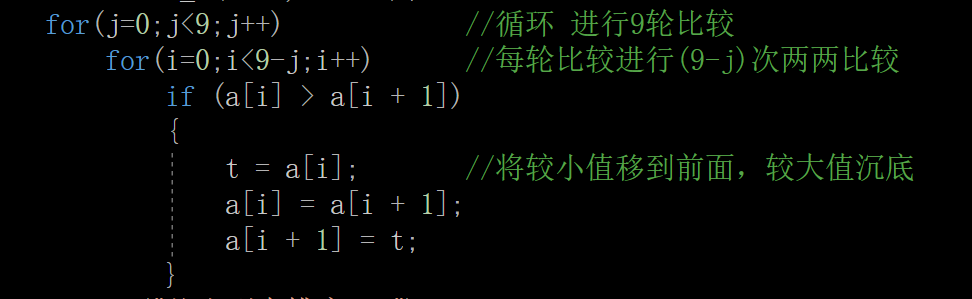

# 冒泡排序法

## 作用

将数组元素从小到大排序

## 原理

先将相邻两元素比较，将较小的元素移到前面，经过一轮比较后数组中最大值沉到最下面；以后的每轮比较原理均和第一轮相同，依次将剩余数中的最大值沉底。

若有n个数进行比较则需要(n-1)轮比较，第一轮比较需要(n-1)次两两比较，第j轮比较需要(n-j)次两两比较；

## 代码核心

看图（假设数组元素为十）（C语言）




```
	int a[10];
	int i, j, t;
	printf("输入十个数:\n");
	for (i = 0; i < 10; i++)
		scanf_s("%d", &a[i]);
	for (j = 0; j < 9; j++)			//循环 进行9轮比较
		for (i = 0; i < 9 - j; i++)		//每轮比较进行(9-j)次两两比较
			if (a[i] > a[i + 1])
			{
				t = a[i];		//将较小值移到前面，较大值沉底
				a[i] = a[i + 1];
				a[i + 1] = t;
			}
	printf("从小到大排序:\n");
	for (i = 0; i < 10; i++)
		printf("%d ", a[i]);
	system("pause");
	return 0;
```